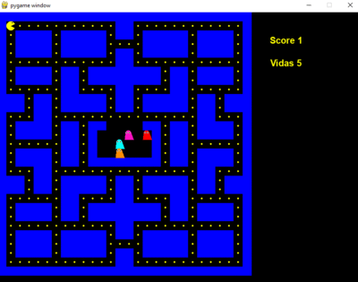

    <h1>Pacman<h1>
    

<h2>Bem vindo(ao) meu repositório</h2>
        
>Status do projeto: Em Desenvolvimento
        
##Descrição do projeto
 

esse projeto trata-se de um jogo simples, porem divertido e é claro, estamos falando do classico pacman

    
## Estados do game

:heavy_check_mark: `Estado 1:` Rodando.

:heavy_check_mark: `Estado 2:` Pause

:heavy_check_mark: `Estado 3:` Game Over

:heavy_check_mark: `Estado 4:` winner
    
<h2 style="text-align:left;">Redes Socias:</h2>
  <li style="text-align:center;"><a href="https://www.linkedin.com/in/habacuque-gosch-de-oliveira-993b45264/">Linkedin</a></li>
<li style="text-align:center;"><a href="https://www.instagram.com/gosch_tlgd"/>Instagram</a></li>

<h2>Guia</h2>

para rodar esse projeto em sua máquina, favor baixar o "pacman.py"

